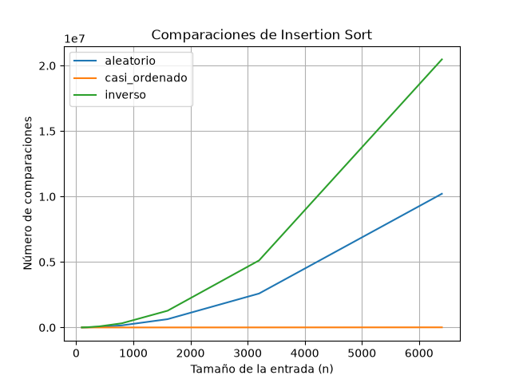
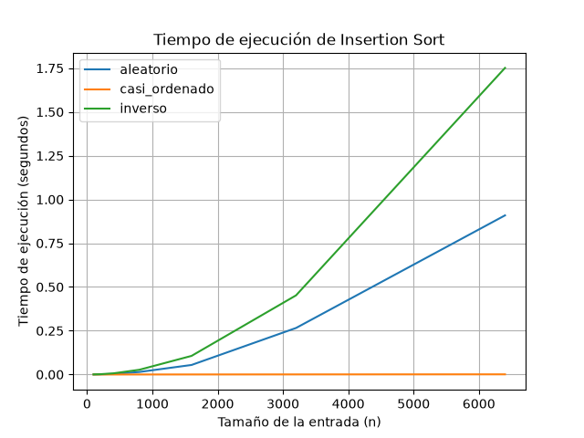
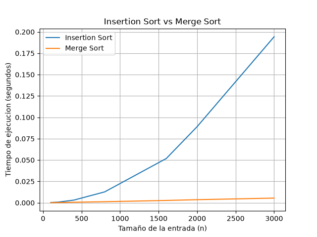

# Laboratorio evaluativo 1. Fundamentos, complejidad y recurrencias

## Parte 1. Analizar el algoritmo antes de comprar hardware

Antes de comprar un servidor con el doble de velocidad, es necesario analizar primero el algoritmo que utiliza actualmente Tamiza. El hecho de que **insertion sort** lleve ocho años funcionando y entregue correctamente los registros no significa que siga siendo adecuado para la cantidad de información que maneja actualmente la plataforma.

En este caso hay que diferenciar entre dos cosas:

- **Corrección**: un algoritmo es correcto cuando nos da el resultado que esperamos; en el caso de Tamiza, esto significa ordenar los pacientes de mayor a menor según su índice de riesgo.
- **Eficiencia**: además de ser correcto, el algoritmo debe hacerlo utilizando los recursos disponibles y **dentro de la restricción establecida**. Actualmente, esa restricción es la ventana de **4 horas**, entre las 2:00 a. m. y las 6:00 a. m., y el sistema ya la está incumpliendo.

El principal problema de mantener insertion sort es que su comportamiento puede crecer demasiado cuando aumenta la cantidad de registros. Por ejemplo, en el caso de Tamiza pasó de trabajar con aproximadamente **20.000 registros** a tener **1.200.000**. Entonces, no estamos frente al mismo problema que existía hace ocho años. Duplicar la velocidad del servidor podría reducir el tiempo de ejecución, pero **no cambia la forma en que el algoritmo crece** cuando aumenta la cantidad de datos.

En el caso que propone el enunciado, se estaría intentando solucionar un problema del software aumentando la capacidad del hardware. Si los datos continúan creciendo, el problema volverá a aparecer, por lo que esta solución sería simplemente **a corto plazo y no a largo plazo**.

**Ejemplo propio:** en una empresa en la cual estuve hace ya un tiempo, tenían un algoritmo para detectar imágenes de algunas facturas.

- Se procesaban entre **1.500 y 3.000 imágenes al día**, dependiendo de la temporada.
- El algoritmo, programado por nosotros, se demoraba entre **2 y 3 horas** en analizarlas, principalmente porque algunas imágenes eran borrosas o difíciles de leer.
- La empresa necesitaba que el sistema entregara los resultados en **menos de una hora** para que los usuarios pudieran continuar con el proceso.

Aunque el algoritmo encontraba correctamente los resultados, no era viable para esa situación porque incumplía la restricción de tiempo. En ese caso tampoco tendría mucho sentido depender únicamente de comprar un equipo más rápido si el algoritmo utilizado no escala bien con el aumento de información. Al final, nos dimos cuenta de que era un problema del algoritmo, ya que tenía mucha redundancia y una mala codificación, por eso es importante revisar el algoritmo y los recursos que usa.

Realmente considero que se debe evaluar y analizar minuciosamente el algoritmo y buscar estrategias que permitan hacer un mejor uso de los recursos del hardware. También se deben analizar otros tipos de algoritmos, como **merge sort**, que puede ser una alternativa para mejorar mucho el comportamiento del ordenamiento cuando aumenta la cantidad de datos. Por ende, Tamiza podría procesar los 1.200.000 registros dentro de la ventana de cuatro horas sin depender solamente de comprar un servidor más potente.

## Parte 2. Responsabilidad ambiental y ética de la implementación

Considero que escoger el algoritmo que va a utilizar Tamiza no es solamente una decisión sobre qué tan rápido funciona el sistema. También tiene consecuencias **ambientales** y **éticas**, especialmente porque estamos hablando de una plataforma relacionada con la salud de las personas y que trabaja todas las madrugadas con información de 1.200.000 pacientes. Por esto, considero que es un tema mucho más delicado que simplemente ordenar una lista de datos.

### Dimensión ambiental

Mientras más tiempo tarde el proceso, más tiempo tiene que estar trabajando el servidor y, por lo tanto, **se utiliza más energía**. Puede que en una sola madrugada la diferencia no parezca tan importante, pero Tamiza realiza este proceso **todos los días**. Si durante meses o años se mantiene un algoritmo que tarda mucho más de lo necesario, ese consumo adicional se va acumulando. Por eso, mejorar el algoritmo también puede ayudar a utilizar mejor los recursos y evitar un gasto de energía que realmente se podría reducir.

### Dimensión ética

Desde el punto de vista ético, considero que el problema es todavía más importante porque estamos hablando de salud. Un error en el orden de los pacientes no es simplemente que una información aparezca en un lugar equivocado.

1. **El paciente.** Por ejemplo, un paciente que tenga un índice de riesgo alto podría quedar por fuera de la lista o ser contactado después de otros pacientes si el proceso no termina a tiempo. Esto podría retrasar su valoración médica. Quien recibe directamente las consecuencias es el paciente, pero también existe una responsabilidad por parte de la Secretaría y del equipo encargado del sistema, porque son quienes deben garantizar que la información se procese correctamente.
2. **El operador del centro de contacto.** Si recibe una lista incompleta o mal ordenada, tendrá que trabajar con información que no muestra correctamente cuáles pacientes deberían ser contactados primero, lo que puede generar más trabajo, reprocesos y presión para los operadores. Por eso, el operador termina asumiendo parte de las consecuencias del error, aunque el problema realmente se origine en el funcionamiento del sistema.

### Una tensión adicional

Además, hay algo que considero todavía más importante: como Tamiza está relacionada con el sector de la salud, el ordenamiento de los datos debe ser **muy preciso**, especialmente al momento de definir qué pacientes tienen mayor prioridad. En la salud, muchas veces el tiempo puede ser muy importante e incluso puede representar una diferencia en la atención de una persona. Por eso, se debe garantizar que el ordenamiento sea correcto y preciso, para evitar que un error en el sistema pueda afectar a un paciente.

## Parte 3. Peor caso, mejor caso y caso promedio, demostrados en Python
 
### 3.1 Explicación
 
| Caso | Explicación |
|---|---|
| **Peor caso** | Es cuando tenemos una cantidad fija de datos y estos están organizados de la forma que más trabajo le genera al algoritmo. Es decir, de todas las entradas que tienen el mismo tamaño, buscamos la que hace que el algoritmo tarde más o haga más operaciones. |
| **Mejor caso** | Es lo contrario al peor caso. Tenemos la misma cantidad fija de datos, pero están organizados de una forma que hace que el algoritmo tenga que trabajar lo menos posible. De todas las entradas de tamaño, sería la que menos tiempo o menos operaciones necesita. |
| **Caso promedio** | Es una forma de saber cómo se comportaría normalmente el algoritmo. Para una cantidad fija de datos, se toma el comportamiento de diferentes entradas y se calcula un promedio entre ellas. |
 
**Caso que utilizaría en Tamiza**
 
Para Tamiza utilizaría el peor caso para decidir si el algoritmo puede entrar en producción. Esto se debe a que tenemos una condición muy clara: los 1.200.000 registros deben ser procesados entre las 2:00 a. m. y las 6:00 a. m., por lo que solamente tenemos cuatro horas.
 
Si solamente analizamos el promedio, podría pasar que normalmente el algoritmo termine a tiempo, pero que cuando los datos estén organizados de una forma más complicada se demore demasiado y no alcance a terminar dentro de las cuatro horas.
 
Por eso considero que lo más seguro es revisar el peor escenario y comprobar que, aun en esa situación, el algoritmo pueda procesar los datos dentro del tiempo disponible. Esto es todavía más importante porque Tamiza trabaja con información relacionada con la salud de las personas.
 
**Predicción antes de realizar el experimento**
 
| Escenario | Predicción |
|---|---|
| **A. Aleatorio** | sería el caso promedio, porque los datos están mezclados y no están ni completamente ordenados ni completamente al contrario. |
| **B. Casi ordenado** | sería el mejor caso, porque el 98% de los datos ya están ordenados y el algoritmo tendría que hacer poco trabajo. |
| **C. Inverso** | sería el peor caso, porque los datos están completamente al contrario del orden que se necesita y, por lo tanto, Insertion Sort tendría que trabajar mucho más. |
 
### 3.2 Demostración experimental
 
**Comparaciones vs. tamaño de entrada:**
 

 
**Tiempo de ejecución vs. tamaño de entrada:**
 

 
Al ver las gráficas, el escenario C (orden inverso) fue el que más le costó al algoritmo: entre más registros había, más se disparaba tanto el número de comparaciones como el tiempo, así que ese fue el peor caso. El escenario B (casi ordenado) fue justo lo contrario: casi no le costó trabajo sin importar cuántos registros tuviera, porque casi todo ya venía en orden. El escenario A (aleatorio) quedó siempre en un punto intermedio entre los otros dos, ni tan rápido como B ni tan lento como C.
 
Esto coincide exactamente con lo que se había predicho antes de hacer las pruebas: que C sería el peor caso, B el mejor y A se comportaría como algo intermedio o normal. Como el resultado no contradijo la predicción, no hay nada que explicar o justificar de forma distinta; simplemente se confirmó lo que se esperaba.

## Parte 4. Complejidad de merge sort e insertion sort: cálculo y validación

## 4.1 Cálculo teórico

### Merge Sort

Merge Sort funciona dividiendo una lista en partes cada vez más pequeñas. Si tenemos una lista de tamaño `n`, primero la divide en **dos partes de aproximadamente `n/2` elementos**. Luego vuelve a hacer lo mismo con cada una de esas partes hasta llegar a listas pequeñas que se puedan ordenar fácilmente.

Por eso tenemos:

```text
T(n) = 2T(n/2) + Θ(n)
```

El primer término:

```text
2T(n/2)
```

Significa que tenemos **2 subproblemas**, y cada uno tiene aproximadamente la mitad de los datos originales.

Después de ordenar las dos partes, hay que volver a unirlas en una sola lista ordenada. Esta parte la realiza `merge`, que va comparando los elementos de las dos partes y los va colocando en el orden correcto. Como tiene que recorrer los elementos para hacer esta unión, el costo de esta parte depende de `n`:

```text
Θ(n)
```

Por eso la recurrencia completa queda asi:

```text
T(n) = 2T(n/2) + Θ(n)
```

---

### Método maestro

Para resolver la recurrencia en mi caso voy a usar el **método maestro**.

Primero identificamos los valores de la fórmula:

```text
T(n) = aT(n/b) + f(n)
```

En nuestro caso:

```text
a = 2
b = 2
f(n) = Θ(n)
```

El `2` de `a` aparece porque Merge Sort se divide en dos partes, y el `2` de `b` aparece porque cada parte tiene `n/2` elementos.

Ahora calculamos:

```text
n^(log_b a)

= n^(log₂ 2)

= n¹

= n
```

Entonces tenemos:

```text
f(n) = Θ(n)
```

y:

```text
n^(log_b a) = Θ(n)
```

Los dos tienen el mismo orden de crecimiento. Por lo tanto, se cumple la condición del **caso 2 del método maestro**.

Aplicando este caso:

```text
T(n) = Θ(n log n)
```

Por lo tanto, la complejidad de **Merge Sort** es:

```text
Θ(n log n)
```

Esto quiere decir que aunque la cantidad de datos aumente, el crecimiento del algoritmo es más controlado.

---

### Insertion Sort

```python
def insertion_sort(datos: list[int]) -> tuple[list[int], int]:
    arreglo = datos.copy()
    comparaciones = 0
    n = len(arreglo)

    for i in range(1, n):
        clave = arreglo[i]
        j = i - 1

        while j >= 0:
            comparaciones += 1
            if arreglo[j] <= clave:
                break
            arreglo[j + 1] = arreglo[j]
            j -= 1

        arreglo[j + 1] = clave

    return arreglo, comparaciones
```

#### Revisando cada línea

| Línea                           | Cantidad aproximada de ejecuciones | Explicación                                                           |
| ------------------------------- | ---------------------------------: | --------------------------------------------------------------------- |
| `arreglo = datos.copy()`        |                                  1 | Se hace una sola copia de la lista.                                   |
| `comparaciones = 0`             |                                  1 | Se inicializa el contador una sola vez.                               |
| `n = len(arreglo)`              |                                  1 | Se obtiene el tamaño una sola vez.                                    |
| `for i in range(1, n)`          |                `n - 1` iteraciones | Se recorre la lista desde el segundo elemento hasta el último.        |
| `clave = arreglo[i]`            |                            `n - 1` | Se toma una vez por cada elemento que se va a insertar.               |
| `j = i - 1`                     |                            `n - 1` | Se ejecuta una vez por cada vuelta del `for`.                         |
| `while j >= 0`                  |               Depende de los datos | Es la parte que más cambia según cómo estén organizados los datos.    |
| `comparaciones += 1`            |               Depende de los datos | Cuenta cada comparación entre elementos.                              |
| `if arreglo[j] <= clave`        |               Depende de los datos | Se revisa cada vez que se compara un elemento.                        |
| `arreglo[j + 1] = arreglo[j]`   |               Depende de los datos | Solo se ejecuta cuando es necesario mover un elemento.                |
| `j -= 1`                        |               Depende de los datos | Se ejecuta cada vez que el elemento debe seguir buscando su posición. |
| `arreglo[j + 1] = clave`        |                            `n - 1` | Se coloca cada elemento en su posición.                               |
| `return arreglo, comparaciones` |                                  1 | Se devuelve el resultado una sola vez.                                |

Las primeras líneas tienen un costo que no cambia demasiado aunque aumentemos la cantidad de datos. También hay varias líneas que se ejecutan una vez por cada elemento.

La parte que realmente cambia el comportamiento de Insertion Sort es el `while`, porque depende de **cómo estén organizados los datos**.

---

### Mejor caso de Insertion Sort

El mejor caso ocurre cuando los datos ya están ordenados.

Por ejemplo:

```text
[1, 2, 3, 4, 5]
```

En este caso, cada elemento se compara con el anterior y rápidamente se encuentra que ya está en la posición correcta.

Para una lista de tamaño `n`, se hacen aproximadamente:

```text
n - 1 comparaciones
```

No es necesario hacer desplazamientos importantes de los elementos.

Por lo tanto:

```text
T(n) = Θ(n)
```

**Mejor caso: Θ(n)**

---

### Peor caso de Insertion Sort

El peor caso ocurre cuando los datos están completamente al contrario del orden que necesitamos.

Por ejemplo:

```text
[5, 4, 3, 2, 1]
```

En este caso, cada nuevo elemento tiene que compararse con todos los elementos que ya están antes de él.

Las comparaciones serían aproximadamente:

```text
1 + 2 + 3 + ... + (n - 1)
```

Esta suma se puede escribir como:

```text
n(n - 1) / 2
```

Desarrollando:

```text
(n² - n) / 2
```

El término que más crece es `n²`, por lo que:

```text
T(n) = Θ(n²)
```

Además, en este caso también se realizan muchos desplazamientos:

```python
arreglo[j + 1] = arreglo[j]
```

Por eso el algoritmo tiene un crecimiento cuadrático.

**Peor caso: Θ(n²)**

---

### Caso promedio de Insertion Sort

El caso promedio se presenta cuando los datos están desordenados, pero no completamente al contrario.

En este caso, algunos elementos estarán cerca de su posición y otros tendrán que moverse más. Por eso el número de comparaciones y desplazamientos queda entre el mejor y el peor caso.

Aunque el trabajo sea menor que en el peor caso, a medida que `n` aumenta el crecimiento sigue siendo cuadrático:

```text
T(n) = Θ(n²)
```

**Caso promedio: Θ(n²)**

---

### Complejidad esperada

| Algoritmo          | Mejor caso | Caso promedio |  Peor caso |
| ------------------ | ---------: | ------------: | ---------: |
| **Insertion Sort** |       Θ(n) |         Θ(n²) |      Θ(n²) |
| **Merge Sort**     | Θ(n log n) |    Θ(n log n) | Θ(n log n) |

Entonces, **Insertion Sort depende mucho de cómo estén organizados los datos**. Cuando ya están ordenados puede funcionar muy bien, pero cuando la cantidad de datos aumenta y están desordenados, su crecimiento puede ser bastante grande.

Merge Sort, en cambio, mantiene **Θ(n log n)** en los tres casos, ya que siempre divide los datos y después los vuelve a combinar. Esto hace que se espere un comportamiento más estable cuando aumenta la cantidad de registros.

### 4.2 Validación experimental
 
Al observar la gráfica, podemos ver que Merge Sort es mejor para Tamiza, especialmente cuando aumenta la cantidad de registros. En tamaños pequeños la diferencia entre los dos algoritmos no es tan grande, pero a medida que aumenta el tamaño de la entrada, Insertion Sort crece mucho más rápido, mientras que Merge Sort mantiene una curva más controlada. Esto es importante para Tamiza porque debe procesar alrededor de 1.200.000 registros de pacientes dentro de una ventana de cuatro horas, por lo que utilizar un algoritmo que tenga un mejor comportamiento cuando aumentan los datos es una opción más adecuada.

El resultado de la gráfica coincide con lo calculado en la Parte 4.1. Insertion Sort tiene una complejidad promedio y de peor caso de Θ(n²), mientras que Merge Sort tiene una complejidad de Θ(n log n). En los tamaños pequeños puede haber poca diferencia entre ambos debido a factores del equipo y del tiempo de ejecución, pero cuando aumenta la cantidad de datos la diferencia se hace mucho más evidente. Por esto, según los resultados obtenidos en la gráfica, Merge Sort sería la mejor opción para Tamiza.
 
 
**Merge Sort vs. Insertion Sort:**
 
